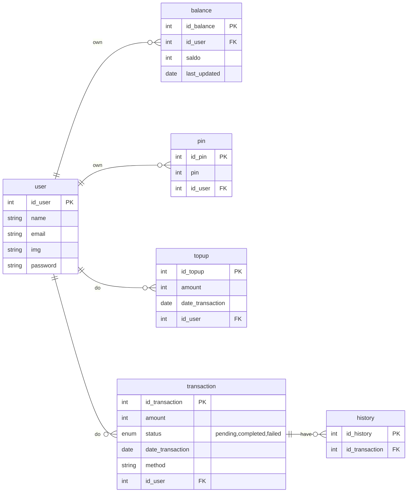

# Go Weekly Database Golang

Perform integration for E-Wallet database using golang technology and frameworks such as gin and implement MVC design patterns, perform database connections using pgx and also postman to help interaction between endpoints.

### Feature :

- Auth-Flow : Login,Register,CreatePin ,UpdateProfile and Change Password
- Top-Up : Create TopUp and GetAll TopUp
- Balance : Create Balance User
- Transaction : Create Transfer and getTansferByuserId
- History : Create History and getAllHistory

## How to Install

Make sure you already install Go to run this project

## How to Run this Project

1. Create a new empty directory for the project
2. Clone this project into the empty current directory:

```
git clone https://github.com/HN721/fgo24-be-weeklytask.git .
```

3. Install dependencies

```
go mod tidy
```

4. Run the project

```
go run main.go
```

## Endpoint

### Auth

| Method | Endpoint         | Description   |
| ------ | ---------------- | ------------- |
| POST   | `/auth/register` | Register user |
| POST   | `/auth/login`    | Login user    |

### Profile

| Method | Endpoint                            | Description            |
| ------ | ----------------------------------- | ---------------------- |
| GET    | `/user`                             | Get user data          |
| GET    | `/user/:id`                         | Get user data by id    |
| GET    | `/user/email?email=nanda@gmail.com` | Get user data by email |
| GET    | `/user?search=`                     | Get user data by name  |
| PUT    | `/user/profile`                     | Update user data       |
| PUT    | `/user/change-password`             | Update Password user   |

### Balance

| Method | Endpoint         | Description       |
| ------ | ---------------- | ----------------- |
| POST   | `/balance/topup` | Topup user Saldo  |
| POST   | `/balance/`      | Create user Saldo |
| GET    | `/balance/`      | Show user Saldo   |

### Transaction

| Method | Endpoint       | Description        |
| ------ | -------------- | ------------------ |
| GET    | `/transaction` | Get Transaction    |
| POST   | `/transaction` | Create Transaction |

### History

| Method | Endpoint   | Description    |
| ------ | ---------- | -------------- |
| GET    | `/history` | Get History    |
| POST   | `/history` | Create History |

## ERD E-WALLET



## Depedencies

- Gin Gonic (github.com/gin-gonic/gin)
- JWT V5 (github.com/golang-jwt/jwt/v5)
- PGX (github.com/jackc/pgx/v5)
- Godotenv (github.com/joho/godotenv)

## Contributing

We welcome contributions! 🚀

If you would like to open a Pull Request (PR), please follow these steps:

1. Fork this repository.

2. Create a new branch:

```
git checkout -b feature/your-feature-name
```

3. Make your changes.

4. Commit your changes with a clear message:

```
git commit -m "Add: your featusre description"
Push your branch to your fork:
```

```
git push origin feature/your-feature-name
```

5. Open a Pull Request (PR) to the main branch of this repository.

6. Make sure your code is clean, well-tested, and consistent with the project style.

7. License
   This project is open-source and available under the MIT License.
